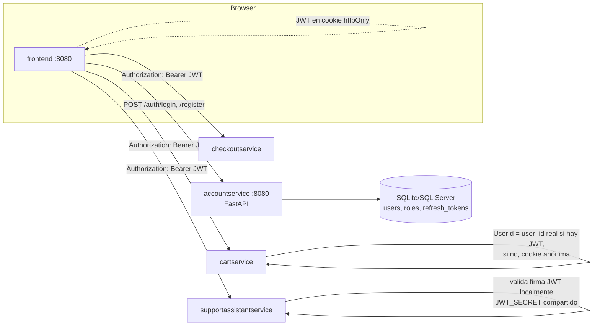
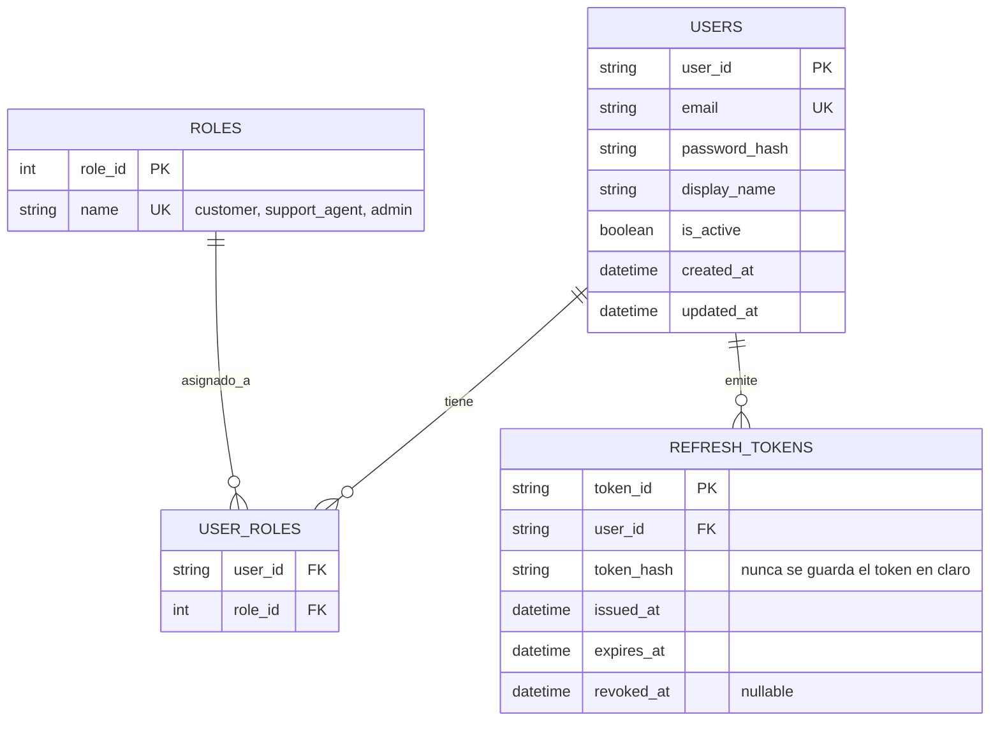

# Autenticación y cuentas de usuario — Diseño técnico

Backlog: [Proyecto BoutiqueChatbot](https://github.com/users/JaobSandoval/projects/2) · Epic [#12](https://github.com/JaobSandoval/online-boutique/issues/12)

## 1. Contexto

Online Boutique no tiene ningún sistema de identidad hoy. El "usuario" es una cookie anónima
(`shop_session-id`, ver `src/frontend/middleware.go`) que se usa directamente como `UserId` al hablar con
`cartservice` y `checkoutservice` (`src/frontend/handlers.go:362`). Funciona porque es un demo, pero no
sobrevive a un cambio de navegador/dispositivo y no permite saber quién es realmente la persona.

El disparador de este epic fue el chatbot ([#3](https://github.com/JaobSandoval/online-boutique/issues/3)):
para dar historial de conversación entre dispositivos y un panel de monitoreo con roles, se necesita una
cuenta real. Pero una vez que existe `accountservice`, el resto de la tienda (carrito, checkout) se beneficia
igual.

## 2. Arquitectura

**Decisión clave:** los servicios que consumen el JWT (frontend, chatbot) lo **validan localmente** verificando
la firma con un secreto compartido (`JWT_SECRET`), en vez de llamar a `accountservice` en cada request. Esto
evita que `accountservice` se vuelva un cuello de botella / punto único de fallo para cada llamada del resto
del sistema — solo se le llama para login/registro/refresh/logout.

## 3. Modelo de datos (normalizado, 3FN)

**Decisiones de normalización:**
- `roles` es tabla de referencia separada de `users` (no una columna `role` de un solo valor): un mismo
  usuario podría ser `customer` y `support_agent` a la vez, y agregar un rol nuevo no requiere migrar `users`.
- `user_roles` es la tabla puente N:M — evita duplicar filas de usuario por cada rol.
- `refresh_tokens` guarda **solo el hash** del token (igual que `users.password_hash`) — si la base de datos
  se filtra, no se filtran tokens utilizables directamente.

## 4. Integración con el resto del sistema

| Servicio existente | Cambio |
|---|---|
| `frontend` | Nuevas rutas `/login`, `/register`; guarda JWT en cookie `httpOnly`; si no hay JWT, sigue funcionando como invitado (cookie anónima actual) — login es opcional |
| `cartservice` / `checkoutservice` | `UserId` = `user_id` real cuando hay JWT válido; si no, se mantiene el comportamiento actual con la cookie anónima |
| `supportassistantservice` | `sessions.user_id` (definido en [`docs/chatbot-support-design.md`](./chatbot-support-design.md)) pasa de string opcional a **FK real** contra `users.user_id`; nuevos endpoints de historial propio (`/chat/history/me`) y panel de monitoreo protegido por rol |

## 5. Plan de ejecución

| Fase | Backlog | Entregable |
|---|---|---|
| 1 | [#13](https://github.com/JaobSandoval/online-boutique/issues/13) Modelo de datos | Esquema `users/roles/user_roles/refresh_tokens` |
| 2 | [#14](https://github.com/JaobSandoval/online-boutique/issues/14) accountservice | Registro/login/refresh/logout funcionando aislado |
| 3 | [#15](https://github.com/JaobSandoval/online-boutique/issues/15) Frontend | Login/registro visibles, invitado no se rompe |
| 4 | [#16](https://github.com/JaobSandoval/online-boutique/issues/16) Carrito/checkout | Carrito persiste entre dispositivos si hay login |
| 5 | [#17](https://github.com/JaobSandoval/online-boutique/issues/17) Chatbot + monitoreo | Historial cross-device, panel admin |
| 6 | [#18](https://github.com/JaobSandoval/online-boutique/issues/18) Seguridad | Rate limiting, rotación de tokens, pruebas |

El orden prioriza que `accountservice` funcione de forma aislada y probada (fases 1-2) antes de tocar
servicios que ya funcionan en producción-demo (carrito, checkout) — así un bug de auth no puede romper la
compra de un invitado.
