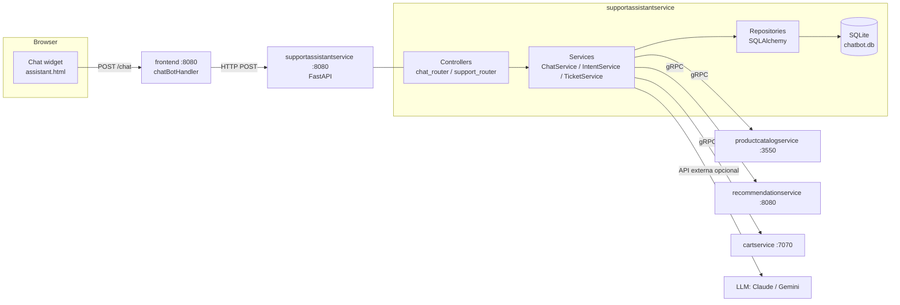
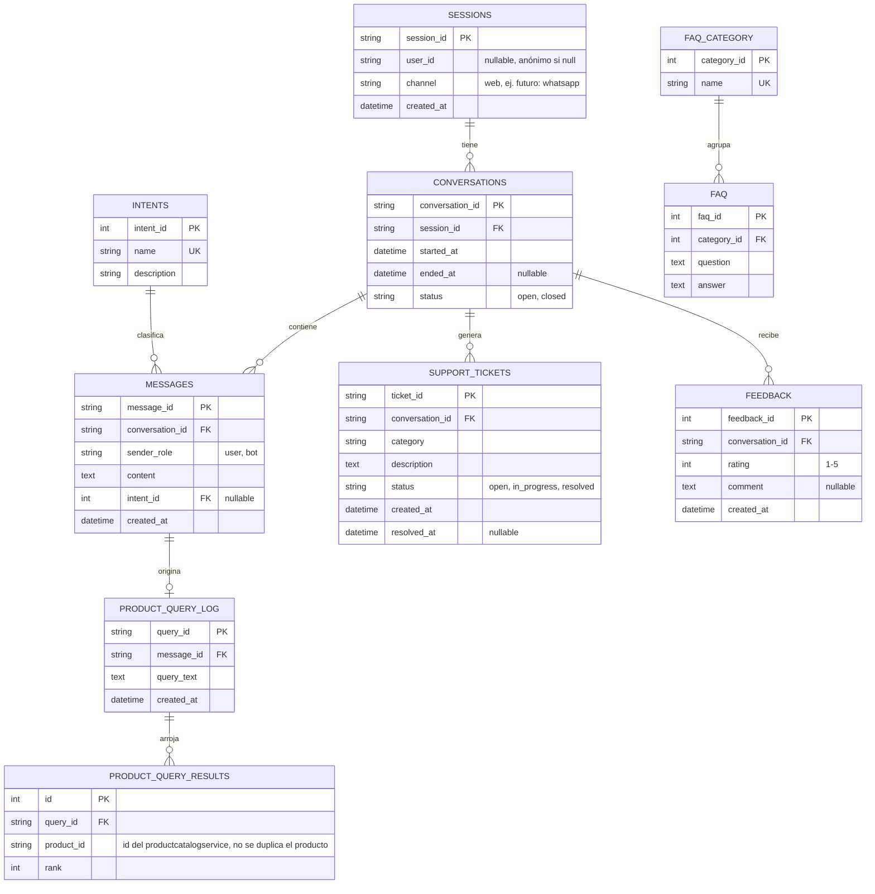

# Chatbot de soporte — Diseño técnico

Backlog: [Proyecto BoutiqueChatbot](https://github.com/users/JaobSandoval/projects/2) · Epic [#3](https://github.com/JaobSandoval/online-boutique/issues/3)

## 1. Contexto

Google ya incluye en el repo un `shoppingassistantservice` (Flask + Gemini + AlloyDB vector store), pero está
acoplado a GCP: requiere Secret Manager, una instancia de AlloyDB (Postgres) y credenciales de Vertex AI. No
puede correr en Docker Compose local sin una cuenta de GCP activa.

El frontend, sin embargo, **ya tiene el contrato de integración construido**:
`src/frontend/handlers.go: chatBotHandler` hace `POST` al `SHOPPING_ASSISTANT_SERVICE_ADDR` con
`{"message": "...", "image": "..."}` y espera `{"content": "..."}` de vuelta. Y `ENABLE_ASSISTANT` ya existe
como feature flag (hoy comentado en `kubernetes-manifests/frontend.yaml`).

**Decisión:** en vez de extender el servicio de Google, se construye un servicio nuevo,
**`supportassistantservice`**, que respeta el mismo contrato HTTP mínimo (para no tocar el frontend en Go),
pero con una arquitectura propia: portable, sin dependencias de GCP, con persistencia local (SQLite) y capaz
de responder con datos reales de la tienda vía gRPC.

## 2. Alcance funcional

- Búsqueda de productos en lenguaje natural ("busco algo para acampar") contra `productcatalogservice`
- Recomendaciones usando `recommendationservice`
- Consultar el contenido del carrito (`cartservice`)
- FAQ y creación de tickets de soporte simulados
- Historial de conversación persistido por sesión

## 3. Arquitectura

## 4. Arquitectura en capas (dentro de `supportassistantservice`)

| Capa | Responsabilidad | Regla dura |
|---|---|---|
| **Controllers** (`routers/`) | Recibir HTTP, validar con Pydantic, devolver DTO | No contiene lógica de negocio ni SQL |
| **Services** (`services/`) | Orquestar: detectar intent, llamar clientes gRPC, decidir qué persistir | No conoce detalles de FastAPI ni de SQL crudo |
| **Clients** (`clients/`) | Wrappers gRPC hacia productcatalog/recommendation/cart | Manejan timeouts/errores, devuelven objetos de dominio |
| **Repositories** (`repositories/`) | Únicos que ejecutan queries contra la BD | Reciben/devuelven modelos SQLAlchemy, no dicts sueltos |
| **Models** (`models/`) | Definición de tablas (SQLAlchemy) | Reflejan el ER normalizado de la sección 5 |

Esta separación es lo que permite que la migración SQLite → SQL Server (backlog [#5](https://github.com/JaobSandoval/online-boutique/issues/5))
sea **solo un cambio de connection string**: nada por encima de `repositories/` sabe qué motor de base de datos
hay debajo.

Mapeo backlog → capa:
- [#4 Controllers](https://github.com/JaobSandoval/online-boutique/issues/4) → capa Controllers
- [#5 Capa de negocio](https://github.com/JaobSandoval/online-boutique/issues/5) → capas Services/Repositories/Models
- [#6 Motor de NLU](https://github.com/JaobSandoval/online-boutique/issues/6) → `IntentService` dentro de Services
- [#7 Integración microservicios](https://github.com/JaobSandoval/online-boutique/issues/7) → capa Clients

## 5. Modelo de datos (SQLite, normalizado a 3FN)

**Decisiones de normalización:**
- `product_query_results` es una tabla aparte (no una columna con lista de IDs separados por coma) para
  cumplir 1FN y permitir ordenar/filtrar por producto individual.
- `intents` y `faq_category` son tablas de referencia (catálogo) en vez de strings libres repetidos en
  `messages`/`faq` — evita inconsistencias ("busqueda" vs "búsqueda") y permite agregar métricas por intent.
- No se duplica el catálogo de productos: `product_query_results.product_id` apunta al ID que ya existe en
  `productcatalogservice` (fuente única de verdad), el chatbot solo guarda la referencia y el ranking.
- Todas las tablas transaccionales tienen `created_at`; las de catálogo (`intents`, `faq_category`) no lo
  necesitan porque no importa cuándo se crearon, solo su valor actual.

## 6. Migración SQLite → SQL Server (si el volumen lo justifica)

1. Cambiar `DATABASE_URL` de `sqlite:///./chatbot.db` a `mssql+pyodbc://...`
2. Generar migración de Alembic para tipos específicos de motor si aplica (ej. `NVARCHAR` vs `TEXT`)
3. Repositories y Services no cambian: solo dependen de la interfaz de SQLAlchemy
4. Añadir el driver (`pyodbc`) y el contenedor de SQL Server al `docker-compose.yaml` como servicio nuevo

## 7. Plan de ejecución (orden sugerido)

| Fase | Backlog | Entregable |
|---|---|---|
| 1 | [#5](https://github.com/JaobSandoval/online-boutique/issues/5) Modelos + migraciones | Esquema SQLite creado, repositorios con tests |
| 2 | [#7](https://github.com/JaobSandoval/online-boutique/issues/7) Clientes gRPC | El servicio puede leer productos/recomendaciones reales |
| 3 | [#6](https://github.com/JaobSandoval/online-boutique/issues/6) Motor de intents | El bot distingue "buscar producto" de "pregunta abierta" |
| 4 | [#4](https://github.com/JaobSandoval/online-boutique/issues/4) Controllers | API REST completa, documentada en OpenAPI |
| 5 | [#8](https://github.com/JaobSandoval/online-boutique/issues/8) Docker | `docker compose up` levanta todo, incluido el bot |
| 6 | [#10](https://github.com/JaobSandoval/online-boutique/issues/10) Frontend | Widget visible y funcional para el usuario final |
| 7 | [#9](https://github.com/JaobSandoval/online-boutique/issues/9) Testing | CI verde, cobertura acordada |

Las fases 1-3 son las de mayor riesgo técnico (definen el modelo de datos y la integración) y por eso van
primero — un cambio de esquema es barato antes de tener controllers y frontend construidos encima.
